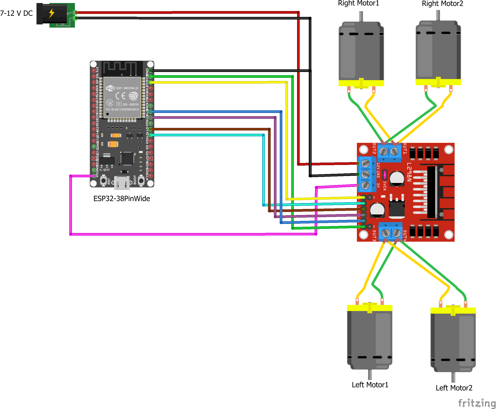

<!-- PROJECT SHIELDS -->

[![Contributors][contributors-shield]][contributors-url]
[![Forks][forks-shield]][forks-url]
[![Stargazers][stars-shield]][stars-url]
[![Issues][issues-shield]][issues-url]
[![LinkedIn][linkedin-shield]][linkedin-url]

# Minotauro

Minotauro is a defensive combat robot designed to compete in the Oshwdem 2023 competition. It is a lightweight 454g 4 wheel drive system that can be controlled by a PS4 controller and can be flipped over and still drive. The chasis was built using polycarbonate, and perforated aluminum ramps.

# Circuit Diagram

[diagram source](https://github.com/un0038998/PS3ControlledCar/blob/main/Diagrams/PS3%20Controlled%20Car.png)
 

# Robot Components:

- **Lithium-Ion Batteries**: Two lithium-Ion Batteries 3.7V. The batteries are connected in series to reach a voltage of 7V. They are connected to a voltage regulator.
- **voltage sensor regulator**: Used to decrease 7.2V to 6V (Maximum voltage accepted by DCmotors). Using a potentiometer we adjisted the voltage to the desired one and pass to the L293N Motor Driver.
- **L293N Motor Driver**: This components allow us to regulate the speed and senso of rotation of the wheels. The driver recive power and supply it to 4 DC motor and the esp32 board. 
- **ESP32 Board**: Recive power to the Motor Driver and output the information receaved by the PS4 controller joistick. 

- **PS4 Contrller**: Connected via Bluetooth to the esp32 driver register and send as output the information recived by left&right joystick.
-**DC Motor**: 4 Dc motor connected in parallel 2 (left) by 2 (right).

 

# Structure

# Control

# Evaluation

Potential improvements:

- **Wheels and tires**: Both the wheels and the tires should be made of a more durable material. The wheels were made of plastic that was broken by the weapons of other robots. Additionally, the wheels should be attached to the motors by a screw (or other method) that is more fixed than our method. Finally, the tires, even though we carefully selected the material to be adhesive, the tape got ripped off after use and we later found better rubber tires available online such as the [28mm rubber wheel Solarbotics RW2i](https://tienda.bricogeek.com/ruedas-robotica/1008-rueda-solarbotics-rw2i.html).

- **Motors**: Our dc motors were very slow and were not poweful enough to push other robots. We should have used more powerful motors and gears such as the [Pololu 37Dx52L mm 12V High-Power 100:1 Metal Gearmotor](https://www.pololu.com/product/4759) or simply [higher voltage motors](https://es.aliexpress.com/item/32896426867.html).

- **Power source**: We spent a lot of weight in the batteries and weren't even close to spending all of the charging. We should have used a smaller battery such as the [batteries used in drones](https://hobbyking.com/es_es/turnigy-nano-tech-300mah-2s-35-70c-lipo-pack.html) that last 10-20 minutes and power 4 motors.

- **Material of the structure**: We used polycarbonate for the structure of the robot. This material is very light and easy to work with, but it is not very resistant to impacts and actually made us loose in the semi-finals. We should have used a more resistant material such as aluminum or metraquilate.

- **Weapon**: Adding a weapon would allow us to attack other robots and have a better chance of winning when we are unable to push the other robot.

<!-- MARKDOWN LINKS & IMAGES [![Name][Shield]][url] -->
<!-- https://www.markdownguide.org/basic-syntax/#reference-style-links -->
[contributors-shield]: https://img.shields.io/github/contributors/IERoboticsClub/minotauro.svg?style=for-the-badge
[contributors-url]: https://github.com/IERoboticsClub/minotauro/graphs/contributors 
[forks-shield]: https://img.shields.io/github/forks/IERoboticsClub/minotauro.svg?style=for-the-badge
[forks-url]: https://github.com/IERoboticsClub/minotauro/network/members
[stars-shield]: https://img.shields.io/github/stars/IERoboticsClub/minotauro.svg?style=for-the-badge
[stars-url]: https://github.com/IERoboticsClub/minotauro/stargazers
[issues-shield]: https://img.shields.io/github/issues/IERoboticsClub/minotauro.svg?style=for-the-badge
[issues-url]: https://github.com/IERoboticsClub/minotauro/issues
[license-shield]: https://img.shields.io/github/license/IERoboticsClub/minotauro.svg?style=for-the-badge
[license-url]: https://github.com/IERoboticsClub/minotauro/blob/master/LICENSE.txt
[linkedin-shield]: https://img.shields.io/badge/-LinkedIn-black.svg?style=for-the-badge&logo=linkedin&colorB=555
[linkedin-url]: https://www.linkedin.com/company/ie-robotics-club/